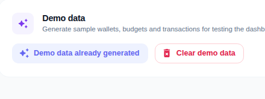
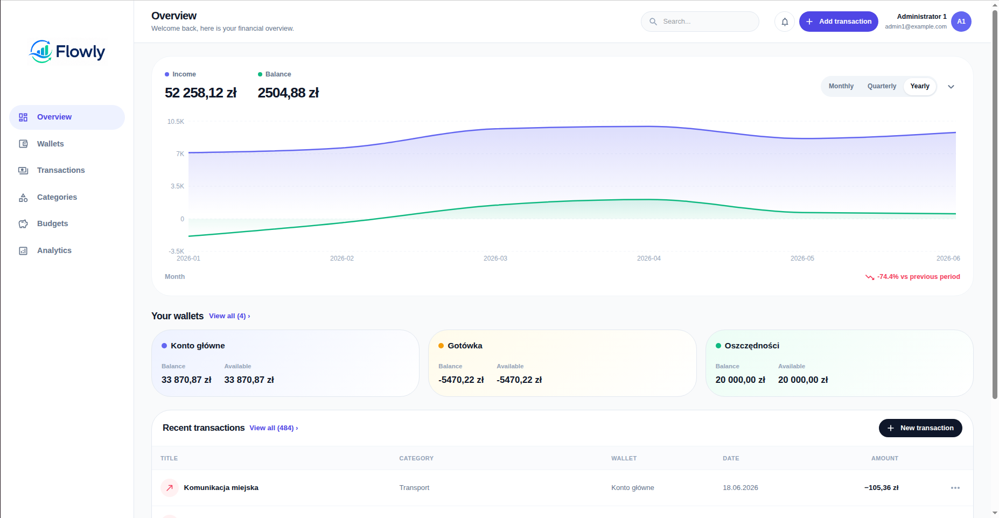
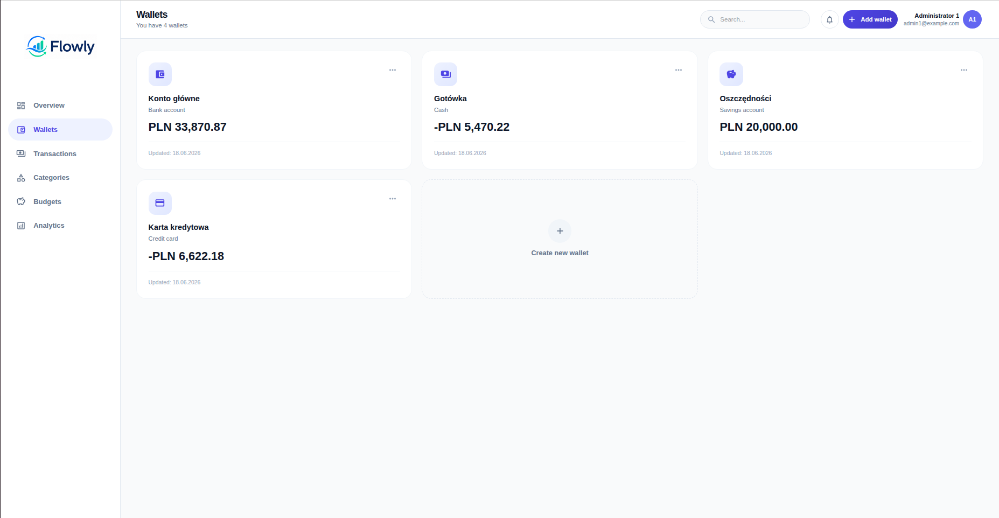
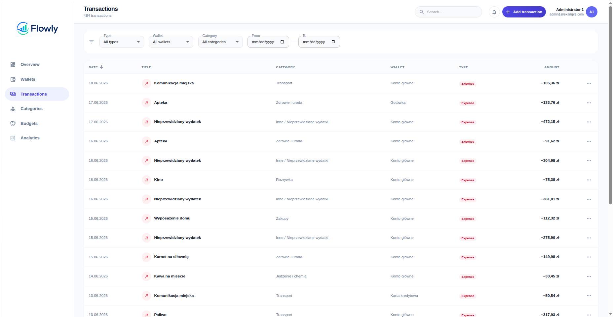
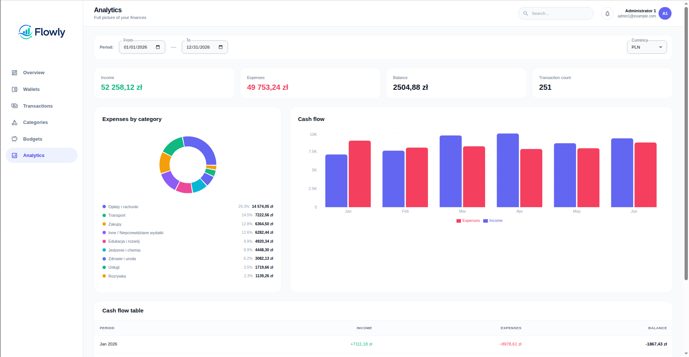
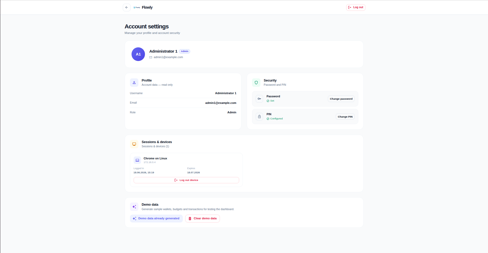

# Expense Tracker

**Expense Tracker** (branded in the UI as **Flowly**) is a fullstack personal finance application for tracking wallets, transactions, categories, budgets, and analytics in one place. The MVP focuses on giving users a clear overview of their money, simple day-to-day expense management, and enough structure to plan spending against budgets. It is built as a portfolio-ready project with a modern React frontend, a Symfony API backend, and Docker-based local and production workflows.

## Main Technologies


## Live Demo

[Open live application] http://20.215.68.246/

## Figma

[Figma] https://www.figma.com/design/ySgn41ESLTGcLKAJ9HypIV/Flowly---design?node-id=0-1&t=J0feKip9sEDEhVaE-1

## Test Account

You can use the following demo account to explore the application:

| Role | Email | Password | PIN |
|---|---|---|---|
| Recruiter / Demo User | recruiter@example.com | Recruiter2026! | 123456

> These credentials are intended only for the public demo environment. Do not use them in production systems containing real data.

## Demo Data generation

Once logged in, navigate to [http://20.215.68.246/settings](http://20.215.68.246/settings) and click the purple Generate Data button.



## Table of Contents

- [MVP Scope](#mvp-scope)
- [Screenshots](#screenshots)
- [Features](#features)
- [Test Account](#test-account)
- [Tech Stack](#tech-stack)
- [Architecture Overview](#architecture-overview)
- [Project Structure](#project-structure)
- [Local Setup](#local-setup)
- [Database Migrations](#database-migrations)
- [Demo Data](#demo-data)
- [Running Tests](#running-tests)
- [API Reference](#api-reference)
- [Production Deployment](#production-deployment)
- [Environment Variables](#environment-variables)
- [Security Notes](#security-notes)
- [Project Status](#project-status)
- [Roadmap](#roadmap)
- [Contributing](#contributing)
- [Author](#author)
- [License](#license)

## MVP Scope

The MVP delivers a complete personal finance workflow for a single user account:

- **Authentication and account security** — registration, login, PIN setup/verification, password change, active session management, and cookie-based JWT sessions with refresh.
- **Financial data management** — wallets, transactions, categories, and budgets with CRUD operations.
- **Insights** — dashboard overview, analytics charts, budget usage tracking, and period summaries.
- **Admin demo tooling** — one-click generation of realistic sample data for portfolio demos and recruiter walkthroughs.

### Problems it solves

- Gives users one place to see balances, recent activity, and spending trends.
- Helps users organize money across multiple wallets and categories.
- Makes it possible to define budgets and monitor real spending against limits.
- Provides a polished demo experience without manually entering months of sample data.

### Main user flow

1. Register a new account.
2. Set up a 6-digit PIN.
3. Land on the dashboard.
4. Create wallets and record income/expense transactions.
5. Define budgets and review analytics.
6. Manage account security from Settings.

### Regular user capabilities

- Register, log in, and authenticate with PIN.
- View dashboard summary, wallet preview, and recent transactions.
- Manage wallets (`cash`, `bank_account`, `credit_card`, `savings_account`).
- Manage transactions with filtering and pagination.
- Use default categories and create custom ones.
- Create and monitor budgets (`monthly`, `yearly`, `custom`).
- Explore analytics with date range and currency filters.
- Change password and PIN, review active sessions, and log out individual devices.

### Administrator capabilities

- Everything a regular user can do.
- Generate demo data from Settings (`ROLE_ADMIN` required).
- Clear previously generated demo data without deleting unrelated user data.
- View persistent demo-data status after page refresh.

## Screenshots












## Features

### Authentication & Security

- User registration and login.
- Mandatory PIN setup after registration.
- PIN verification on subsequent logins.
- HttpOnly cookie-based JWT authentication with refresh token rotation.
- Session listing and per-device logout.
- Password change from Settings.
- Password reset API endpoints (`/api/password/forgot`, `/api/password/reset`) — backend support exists; frontend reset UI is not implemented yet.
- Login rate limiting and session cleanup command.

### Personal Finance Management

- **Wallets** — create, edit, view, and delete wallets with balances stored in minor currency units.
- **Transactions** — income and expense records linked to wallets and categories, with wallet balance updates.
- **Categories** — built-in default categories plus user-defined custom categories.
- **Budgets** — monthly, yearly, or custom periods with spent/remaining/percentage/status calculated from real transactions.

### Analytics & Budgeting

- Dashboard hero card with selectable range and balance trend.
- Analytics page with summary stats, expenses-by-category chart, and cash-flow chart/table.
- Budget overview endpoint with `ok`, `warning`, and `exceeded` status thresholds.
- Supported currencies: `PLN`, `EUR`, `USD`, `GBP`.

### Admin / Demo Mode

- Admin-only demo data generator in **Settings → Demo data**.
- Generates 4 wallets, 12 months of monthly budgets, and a large set of transactions (plus default categories if missing).
- Tracks generated entities in `DemoDataBatch` / `DemoDataRecord` so only demo data is removed on clear.
- Persistent status endpoint: `GET /api/admin/demo-data/status`.

### Additional UI Features

- Live currency rate panel on the auth screen (EUR, USD, GBP via the public NBP API).
- Responsive Material UI layout with sidebar navigation.
- Splash screen during auth bootstrap and automatic token refresh on `401`.


## Tech Stack

### Frontend

| Technology | Version / Notes |
|---|---|
| React | 19.x |
| TypeScript | 6.x |
| Vite | 8.x |
| Material UI (MUI) | 9.x |
| React Router | 7.x |
| TanStack Query | 5.x |
| Axios | 1.x |
| Zod | 4.x |
| React Hook Form | 7.x |
| Recharts | 3.x |
| Motion | 12.x |

### Backend

| Technology | Version / Notes |
|---|---|
| PHP | >= 8.2 |
| Symfony | 6.4 |
| Doctrine ORM | 3.x |
| Doctrine Migrations | 3.x |
| MySQL | 8.0 |
| Lexik JWT Authentication Bundle | Cookie-based JWT auth |
| Nelmio API Doc Bundle | Swagger UI at `/api/doc` |
| Nelmio CORS Bundle | Configurable allowed origins |
| Symfony Mailer | Password reset emails (Mailpit locally) |
| PHPUnit | 11.x |
| PHPStan | 2.x (with Symfony + Doctrine extensions) |
| PHP-CS-Fixer | Project-wide formatting rules |

### Infrastructure

| Technology | Usage |
|---|---|
| Docker & Docker Compose | Local development and production orchestration |
| FrankenPHP | API runtime (local and production) |
| Nginx | Serves production React build and proxies `/api` |
| Mailpit | Local email capture (`8025` UI, `1025` SMTP) |
| Azure VM | Production hosting target |

## Architecture Overview

The application follows a classic fullstack split:

- The **React frontend** handles UI, routing, form validation, and client state.
- The **Symfony API** exposes JSON endpoints, enforces authentication/authorization, and contains business logic.
- **MySQL** stores users, sessions, wallets, transactions, categories, budgets, and demo-data metadata.
- Locally, all services run via `docker-compose.yml`.
- In production, `docker-compose.prod.yml` runs MySQL, the API container, and an Nginx web container.
- The production frontend is built to static files and served by Nginx; API traffic is proxied through `/api`.
- The database and API are not exposed publicly in the production topology — only the web container port is published.

```text
Browser
   |
   v
Nginx / Web container
   |---- serves React static files
   |
   |---- /api -> Symfony API container (FrankenPHP)
                     |
                     v
                  MySQL
```

### Backend design highlights

- Feature-oriented modules (`Auth`, `Wallet`, `Transaction`, `Category`, `Budget`, `Analytics`, `DemoData`, `Session`).
- Request DTOs, Action classes, and response DTOs for API boundaries.
- Repository layer for persistence.
- Amounts stored as integers in minor units (e.g. `300000` = `3000.00`).

### Frontend design highlights

- Feature-sliced structure under `frontend/src/features/`.
- Shared `httpClient` with Zod response parsing and single-flight token refresh.
- TanStack Query for server state and cache invalidation.

## Project Structure

```text
.
├── api/                              # Symfony backend
│   ├── config/                       # Symfony, Doctrine, JWT, CORS, API docs
│   ├── migrations/                   # Doctrine migrations
│   ├── src/
│   │   ├── Auth/                     # Registration, login, PIN, tokens
│   │   ├── Wallet/                   # Wallet CRUD
│   │   ├── Transaction/              # Transaction CRUD and balance logic
│   │   ├── Category/                 # Categories and defaults
│   │   ├── Budget/                   # Budgets and overview
│   │   ├── Analytics/                # Dashboard and analytics queries
│   │   ├── DemoData/                 # Admin demo data generation/cleanup
│   │   ├── Session/                  # Session listing and revocation
│   │   └── Entity/                   # Core entities (User, Session, etc.)
│   ├── tests/                        # PHPUnit functional and unit tests
│   ├── Dockerfile                    # Local API image (FrankenPHP)
│   └── Dockerfile.prod               # Production API image
├── frontend/                         # React frontend
│   ├── public/                       # Static assets and README screenshots
│   ├── src/
│   │   ├── app/                      # Router, layouts, theme
│   │   ├── features/                 # auth, dashboard, wallets, transactions, ...
│   │   └── shared/                   # httpClient, UI primitives, utilities
│   ├── Dockerfile.prod               # Production Nginx image
│   └── nginx.conf                    # SPA routing + /api proxy
├── docker-compose.yml                # Local development environment
├── docker-compose.prod.yml           # Production deployment setup
├── .env.example                      # Local Docker Compose variables
├── .env.prod.example                 # Production environment template
├── .php-cs-fixer.dist.php            # PHP code style rules
└── README.md
```

## Local Setup

### Prerequisites

- Git
- Docker
- Docker Compose plugin

Optional (if you want to run services outside Docker):

- Node.js 20+
- npm
- PHP 8.2+
- Composer 2

### Clone repository

```bash
git clone https://github.com/SekjuRiczard/expense-tracker.git
cd expense-tracker
```

### Environment configuration

1. Create the root Docker Compose environment file:

```bash
cp .env.example .env
```

Example local values (adjust if needed):

```env
DB_ROOT_PASSWORD=root
DB_NAME=expense_tracker
DB_PORT=3306
DB_TEST_PORT=3307
API_PORT=8080
FRONT_PORT=3000
```

2. Configure the Symfony API environment (not committed):

```bash
cp api/.env.example api/.env.local
```

Set at minimum:

```env
APP_SECRET=change_me_local_secret
DATABASE_URL="mysql://root:root@db:3306/expense_tracker?serverVersion=8.0.36&charset=utf8mb4"
JWT_PASSPHRASE=change_me_jwt_passphrase
CORS_ALLOW_ORIGIN=^https?://(localhost|127\.0\.0\.1)(:[0-9]+)?$
MAILER_DSN=smtp://mailpit:1025
MAILER_FROM=no-reply@localhost
AUTH_COOKIE_SECURE=false
```

3. Configure the frontend API URL:

```bash
cp frontend/.env.example frontend/.env
```

Default:

```env
VITE_API_URL=http://localhost:8080
VITE_API_TIMEOUT_MS=10000
```

### Start containers

```bash
docker compose up -d --build
```

### Local URLs

| Service | URL |
|---|---|
| Frontend (Vite dev server) | http://localhost:3000 |
| API | http://localhost:8080 |
| Swagger UI | http://localhost:8080/api/doc |
| Mailpit (email UI) | http://localhost:8025 |
| MySQL | localhost:3306 |
| MySQL (test) | localhost:3307 |

### First-time API setup

Generate JWT keys and run migrations:

```bash
docker compose exec api php bin/console lexik:jwt:generate-keypair --skip-if-exists
docker compose exec api php bin/console doctrine:migrations:migrate --no-interaction
docker compose exec api php bin/console app:category:initialize-defaults-categories
```

## Database Migrations

Apply pending migrations:

```bash
docker compose exec api php bin/console doctrine:migrations:migrate --no-interaction
```

Check migration status:

```bash
docker compose exec api php bin/console doctrine:migrations:status
```

There are no database seeders or fixtures CLI commands beyond:

- `app:category:initialize-defaults-categories` — seeds global default categories.
- Admin demo data generation — available from the Settings UI (see [Demo Data](#demo-data)).

## Demo Data

The demo data feature helps recruiters and reviewers explore the app without manual data entry.

### What it creates

Based on `DemoDataGenerator`:

- **4 wallets** — main bank account, cash, savings, and credit card (PLN).
- **12 monthly budgets** — one per month for the last 12 months.
- **Hundreds of transactions** — salary, recurring expenses, variable expenses, and extra income across 12 months.
- **Default categories** — initialized automatically if missing.

### Requirements

- User must have `ROLE_ADMIN`.
- Only one active demo batch per user; generating again returns `409 Conflict`.

### How to use it

1. Log in as an admin user.
2. Open **Settings** (`/settings`) — click the avatar/user card in the top-right header, or navigate directly.
3. Scroll to the **Demo data** section.
4. Click **Generate demo data**.
5. Explore Dashboard, Wallets, Transactions, Budgets, and Analytics.
6. To remove only generated demo data, click **Clear demo data**.

The UI reads persistent status from `GET /api/admin/demo-data/status`, so the clear button remains visible after refresh.

## Running Tests

### Backend

Run the full PHPUnit suite:

```bash
docker compose exec api php bin/phpunit
```

Run a specific test class:

```bash
docker compose exec api php bin/phpunit --filter ListSessionsTest
```

### Static Analysis / Code Quality

```bash
docker compose exec api vendor/bin/phpstan analyse
docker compose exec api vendor/bin/php-cs-fixer fix --dry-run --config=../.php-cs-fixer.dist.php
```

> Note: PHPStan configuration may require a generated Symfony container cache in your environment.

### Frontend

```bash
cd frontend
npm run lint
npm run build
```

Available scripts from `frontend/package.json`: `dev`, `build`, `lint`, `preview`.

## API Reference

The backend exposes JSON endpoints consumed by the frontend.

### Interactive documentation

When the API is running:

- **Swagger UI:** [http://localhost:8080/api/doc](http://localhost:8080/api/doc)

### Main endpoint groups

| Area | Base path | Notes |
|---|---|---|
| Auth | `/api/register`, `/api/login`, `/api/logout`, `/api/me` | Registration, login, current user |
| PIN | `/api/pin/setup`, `/api/pin/verify`, `/api/pin/change` | PIN lifecycle |
| Tokens | `/api/token/refresh` | Refresh cookie rotation |
| Sessions | `/api/auth/sessions` | List and revoke sessions |
| Password | `/api/password/change`, `/api/password/forgot`, `/api/password/reset` | Account recovery |
| Wallets | `/api/wallets` | Wallet CRUD |
| Categories | `/api/categories` | Category CRUD + defaults |
| Transactions | `/api/transactions` | Transaction CRUD + pagination |
| Budgets | `/api/budgets`, `/api/budgets/overview` | Budget CRUD + usage overview |
| Analytics | `/api/analytics/*` | Dashboard, summary, categories, cash flow |
| Demo data (admin) | `/api/admin/demo-data` | Generate, clear, status |

Authentication uses HttpOnly cookies (`access_token`, `refresh_token`, `partial_access_token` during PIN flow). The frontend sends requests with `withCredentials: true`.

## Production Deployment

The application is designed to run on a single host (e.g. an **Azure Virtual Machine**) using Docker Compose.

Production setup includes:

- MySQL database container with persistent volume.
- Symfony API container (FrankenPHP).
- Nginx web container serving the React production build.
- `/api` proxied from Nginx to the API container.
- Secrets stored in `.env.prod` (not committed).
- JWT keys generated inside the API container volume on first start.

### Quick production commands

```bash
cp .env.prod.example .env.prod
# Edit .env.prod with real secrets and domain settings

docker compose --env-file .env.prod -f docker-compose.prod.yml up -d --build
docker compose --env-file .env.prod -f docker-compose.prod.yml exec api php bin/console doctrine:migrations:migrate --no-interaction
```

Set `RUN_MIGRATIONS=1` in `.env.prod` if you want migrations to run automatically on API container startup.

TODO: add `README_DEPLOY.md` with the full step-by-step Azure VM deployment guide if it should live in this repository.

## Environment Variables

| File | Purpose | Committed |
|---|---|---|
| `.env.example` | Local Docker Compose ports and DB names | Yes |
| `.env` | Local Docker Compose values | No |
| `.env.prod.example` | Production template without secrets | Yes |
| `.env.prod` | Real production secrets | No |
| `api/.env.example` | Symfony configuration template | Yes |
| `api/.env.local` | Local Symfony secrets and `DATABASE_URL` | No |
| `frontend/.env.example` | Frontend API URL template | Yes |
| `frontend/.env` | Local Vite environment | No |

### Key variables

| Variable | Description |
|---|---|
| `DB_NAME` | MySQL database name |
| `DB_USER` | MySQL application user (production) |
| `DB_PASSWORD` | MySQL application password (production) |
| `DB_ROOT_PASSWORD` | MySQL root password |
| `DB_PORT` | Host port for local MySQL |
| `API_PORT` | Host port for local API |
| `FRONT_PORT` | Host port for local frontend dev server |
| `HTTP_PORT` | Host port for production web container |
| `APP_SECRET` | Symfony secret |
| `JWT_PASSPHRASE` | Passphrase for JWT key pair |
| `CORS_ALLOW_ORIGIN` | Allowed CORS origin regex |
| `AUTH_COOKIE_SECURE` | `true` for HTTPS-only cookies in production |
| `MAILER_DSN` | Mailer transport (`null://null` disables sending) |
| `MAILER_FROM` | Default sender address |
| `VITE_API_URL` | Frontend API base URL (`/api` in production) |
| `VITE_API_TIMEOUT_MS` | Frontend HTTP timeout |
| `RUN_MIGRATIONS` | `1` to auto-run migrations on API container start |

Never commit real production secrets, `.env.prod`, or JWT `.pem` files.

## Security Notes

- `.env.prod`, `api/.env.local`, and local `.env` files are gitignored.
- JWT private/public keys (`api/config/jwt/*.pem`) are generated on the server and excluded from Git.
- The production database is not published to the public internet — only the web container port is exposed.
- API access in production goes through the Nginx reverse proxy at `/api`.
- Demo credentials are for the public demo environment only.
- HttpOnly cookies, refresh token rotation, session revocation, and login rate limiting are implemented.
- Set `AUTH_COOKIE_SECURE=true` when serving the app over HTTPS.

## Project Status

The project is **MVP-complete** and **portfolio-ready**. Core financial workflows, analytics, authentication, and admin demo tooling are implemented and covered by automated backend tests. The application is designed for deployment on an Azure VM using Docker Compose and can be extended with CI/CD, HTTPS, and additional reporting features.

## Roadmap

- HTTPS and custom domain
- CI/CD pipeline (GitHub Actions)
- Frontend password reset flow
- E2E tests (Playwright / Cypress)
- Export to CSV/PDF
- Recurring transactions
- Multi-wallet transfers
- Improved API documentation coverage in Swagger
- Additional analytics views and comparisons
- `README_DEPLOY.md` with full Azure deployment walkthrough

## Contributing

This is primarily a portfolio project, but issues and suggestions are welcome. If you find a bug or have an improvement idea, feel free to open an issue or submit a pull request.

## Author

Created by **Dawid Osak**.

- GitHub: [https://github.com/SekjuRiczard](https://github.com/SekjuRiczard)
- LinkedIn: TODO
- Portfolio: TODO

## License

TODO: Add license information. (`api/composer.json` currently declares `"license": "proprietary"`.)
